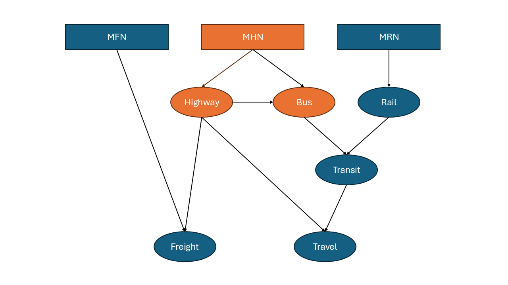

# mfhrn_programs
Programs for processing the Master Freight Network (MFN) for freight/travel modeling. 

At a conceptual level, the way MHN fits together with the MFN and MRN for processing is described by the (greatly simplified) diagram:

The boxes represent input while the circles represent output. As you can see from the diagram, the highway and bus output from the MHN are a crucial first step in freight/travel modeling. 

To get started with this repository, check out the wiki. 

## Objectives 
This repository contains scripts and tools where the MFN (and any other necessary files) can be processed for input into either the freight model or travel model for analysis. 

There are four main objectives:
1. Currently there are three separate repositories for the MFN, MHN, and MRN, with overlap between the three. This repository attempts to rewrite the original MHN repository while considering its place in the overall process.
2. The original MHN repository has code written in both Python and SAS, where sometimes a Python script will call a SAS script (or vice versa). This repository aims to have its code written in Python and to completely eliminate reliance on SAS.
3. This repository aims to have a clear workflow. Input/output should be made clear, as well as script dependencies. It aims to avoid nested scripts and chicken/egg situations (where running script A depends on the output of script B while running script B depends on the output of script A). 
4. Everything should be well documented.