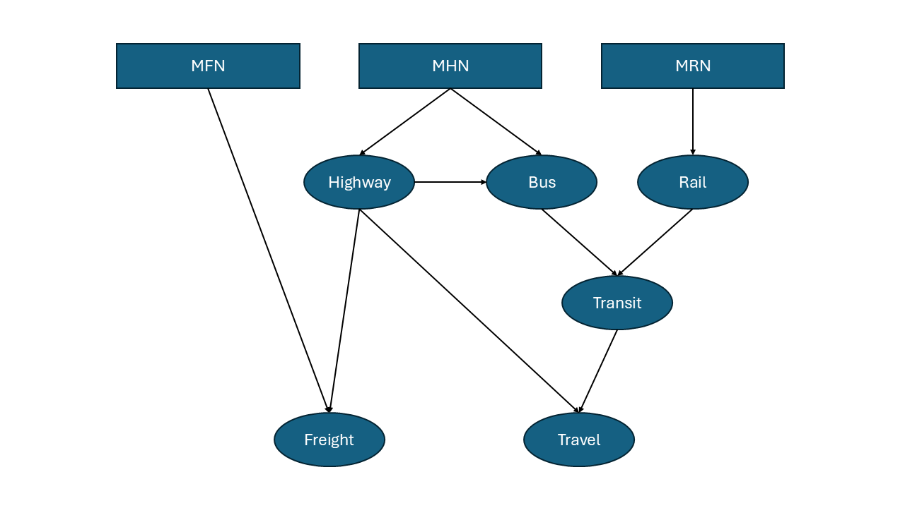

# mfhrn_programs
Programs for processing the Master Freight Network (MFN), Master Highway Network (MHN), and Master Rail Network (MRN) for freight/travel modeling. 

At a conceptual level, the way MFN/MHN/MRN fit together for processing is described by the (greatly simplified) diagram, where the boxes represent input and circles represent output: 

We can then see processing as following two separate paths: 

A **freight path**... 

... and a **travel path**. 

To get started with this repository, check out the wiki. 

## Objectives 
This repository holds scripts and tools where the MFN, MHN, and MRN (and any other necessary files) can be processed together for input into either the freight model or travel model for analysis. 

There are four main objectives:
1. Currently there are three separate repositories for the MFN, MHN, and MRN. The freight model requires input from both the MFN and the MHN, while the travel model requires input from both the MHN and the MRN. This repository aims to resolve inconsistencies between the three original repositories.
2. All three of the original repositories have code written in multiple languages, including SAS. Sometimes a Python script will call a SAS script or an R script will call a SAS script. This repository aims to have its code written in Python and R and to completely eliminate reliance on SAS.
3. This repository also aims to simplify the three processes. Input/output should be made clear, as well as script dependencies. It aims to avoid nested scripts and chicken/egg situations (where running script A depends on the output of script B while running script B depends on the output of script A). 
4. Everything should be well documented.

During the course of my summer internship (up to 09/04) I will be focusing on translating scripts relating only to the MHN (as Tim gave me the task of translating scripts from mhn_programs). The orange in the diagram represents what I will be working on. The folder I will be working in is scripts/1_MHN. It's a fairly straightforward translation of mhn_programs, except that the parts which also use input from the MRN will not be translated.  

